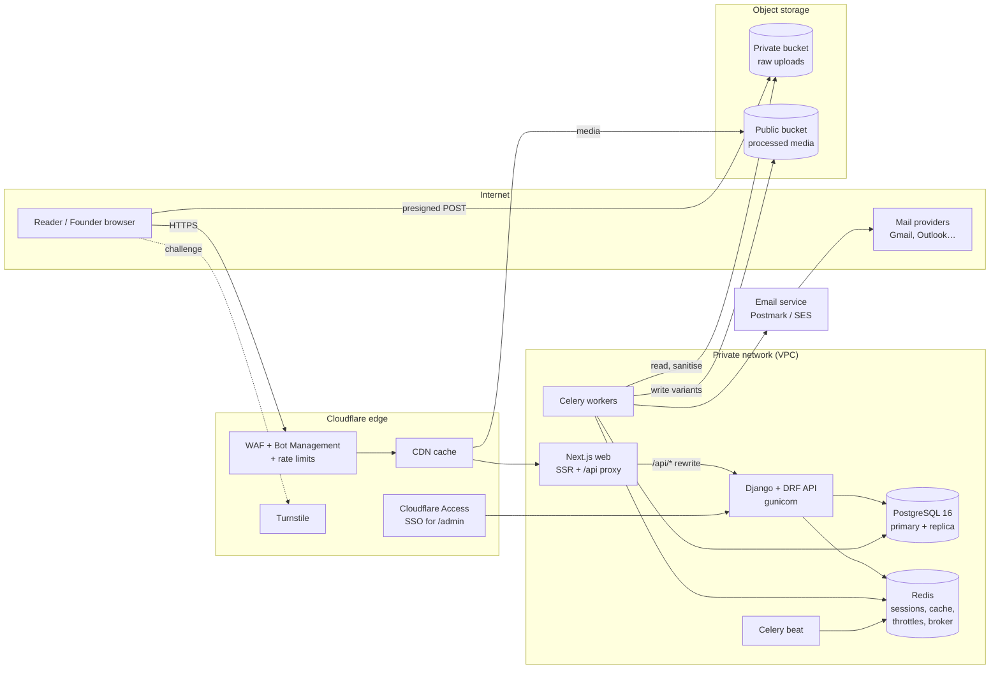
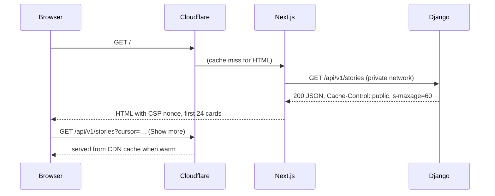

# 02 · System Architecture

## Shape of the system

A **modular monolith**: one Django codebase split into bounded-context apps, one Next.js
web app, one Postgres database and one Redis. At this scale a monolith gives the smallest
attack surface and the fewest moving parts to secure. The app boundaries below are drawn so
that any one of them could be split out later without redesign.



## Components

| Component | Tech | Responsibility | Trust level |
|---|---|---|---|
| Edge | Cloudflare | TLS termination, WAF, bot scoring, L7 rate limits, caching anonymous GETs, Access SSO for staff | Untrusted input arrives here |
| Web | Next.js 15 (App Router) | Server-rendered HTML, per-request CSP nonce, same-origin proxy of `/api/*` to Django | No secrets except the internal API URL |
| API | Django 5.2 LTS + DRF | All business rules, authentication, authorization, validation, audit | Holds the DB, Redis and field-encryption credentials |
| Workers | Celery 5 | Image sanitisation, email sending, digest build and send, verification expiry, audit-chain check | Same credentials as the API; no inbound network |
| Database | PostgreSQL 16 | Source of truth; append-only triggers; least-privilege roles | Private subnet only |
| Cache/broker | Redis 7 | Sessions (revocable), throttle counters, Celery broker | Private subnet, AUTH + TLS |
| Object storage | S3 / R2 (MinIO locally) | Raw uploads (private) and processed media (CDN-only) | Buckets split by trust |
| Email | Postmark or SES | Transactional and digest sending | Outbound only |

## Backend module map

```
backend/apps/
  common/        security primitives: client IP, throttles, permissions, encrypted field,
                 CSP middleware, Turnstile, hashing, pagination, error envelope, email task
  audit/         hash-chained append-only AuditLog, verify_chain(), nightly check
  accounts/      User (UUID PK, roles, TOTP, lockout), signup/login/2FA API
  verification/  Company, FounderProfile, VerificationRequest, domain + evidence checks
  stories/       Story, StoryRevision (hash chain), Media, Tag, Markdown sanitiser,
                 image pipeline, feed / detail / publish / upload API, seed command
  engagement/    Like, Board, Save, Comment, Follow, Report
  moderation/    ModerationAction, rule-based spam checks, moderator API
  digest/        Subscription, DigestIssue/Item/Delivery, curation, sending, signed tokens
```

**Dependency rule:** `common` and `audit` depend on nothing else in the project. Domain apps
may depend on `common`, `audit` and on apps "below" them (stories ← engagement ←
moderation), never upward. Cross-app writes go through a `services.py` function, which is
where transactions and audit entries live. Views stay thin.

## Key request flows

### 1. Anonymous reader opens the wall


### 2. Founder publishes a story
1. `POST /api/v1/stories` sends the session cookie and the `X-CSRFToken` header.
2. DRF checks the session, CSRF, `IsVerifiedFounder` (verified, not expired, not
   suspended, 2FA on) and the throttle scope `write`.
3. `stories.services.save_revision()` runs in one transaction. It renders the Markdown
   to sanitised HTML, computes `content_hash`, appends a `StoryRevision` chained to the
   previous one, and appends an `AuditLog` entry.
4. `POST /stories/{slug}/publish` flips the status to published and records another audit entry.

### 3. Image upload (bytes never touch the API)
1. `POST /media/uploads` creates a `Media(pending)` row and returns a **presigned POST**
   scoped to one key, one content type, at most 10 MB, valid for 5 minutes, targeting the
   **private** bucket.
2. The browser uploads directly to storage.
3. `POST /media/{id}/complete` marks it processing and enqueues `process_media`.
4. The worker checks magic bytes, verifies structure, applies the pixel cap, fully
   re-encodes to WebP, strips all metadata, watermarks the display size, and writes
   `display` and `thumb` variants to the public bucket. Then it marks the media ready.
5. Only then can the media be attached as a cover (`cover_id` is checked for owner and `ready`).

### 4. Founder verification
See [06-founder-verification.md](06-founder-verification.md) for the state machine.

### 5. Weekly digest
Beat (Sunday 12:00 UTC) triggers `build_weekly_digest`, which creates a **draft** issue.
An editor reviews it in the admin and approves and schedules it. Every 15 minutes beat
runs `send_scheduled_issues`, which starts a send task that claims a `DigestDelivery` row
per subscriber *before* sending, so the send is idempotent across retries and crashes.
See [08](08-email-digest.md).

## Synchronous vs asynchronous

| Work | Where | Why |
|---|---|---|
| Validation, auth, DB writes, audit | Request (sync) | Must be atomic with the change |
| Markdown render and sanitise | Request (sync) | Cheap; the stored HTML is always consistent with the source |
| Image processing | Worker | CPU-heavy, untrusted input, isolated from the web tier |
| Transactional email | Worker (`send_email_task`) | Provider outages retry and never become 500s; timing doesn't leak |
| Digest build and send | Beat + worker | Scheduled, long-running, resumable |
| Verification expiry, audit-chain verification | Beat + worker | Periodic integrity jobs |

## Scaling path

| Stage | Load | Changes |
|---|---|---|
| Launch | ≤ 100k MAU | 2× web, 2× API, 1× worker, managed Postgres (1 primary + 1 replica), managed Redis |
| Growth | ≤ 1M MAU | Horizontal web/API autoscaling; route public feed reads to the read replica; separate Celery queues (`media`, `email`, `default`) |
| Large | 10M MAU | Postgres partitioning for `engagement_like` and `audit_auditlog` by month; dedicated search (OpenSearch) fed by CDC; email moves to a provider batch API |

The anonymous read path is aggressively CDN-cached (30–60 s). Traffic spikes, including
scraping bursts, are mostly absorbed at the edge and never reach Django.
