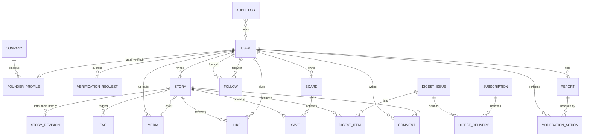

# 03 · Data Model

PostgreSQL is the single source of truth. Principles:

- **UUID primary keys** for every externally referenced entity (users, stories, media,
  boards, comments, reports, verification requests), so there are no sequential IDs to
  enumerate or scrape.
- **Constraints in the database**, not just in code: unique likes, one open verification
  per user, no self-follow, and so on.
- **Append-only history**: `audit_auditlog` and `stories_storyrevision` reject UPDATE and
  DELETE through a trigger ([migration](../backend/apps/audit/migrations/0002_append_only_trigger.py)).
- **Soft states over deletes** for user content (`hidden`, `removed`), so moderation is
  reversible and auditable.
- **Encrypted at rest (field level)** for the most sensitive values: TOTP secrets and
  verification notes (Fernet, rotatable keys). The whole database is also encrypted at
  rest by the provider.

## Entity-relationship diagram

## Tables

### accounts_user
| Column | Type | Notes |
|---|---|---|
| id | uuid PK | |
| email | citext-like unique | lower-cased on write |
| handle | varchar(30) unique | `^[a-z0-9](?:[a-z0-9_]{1,28}[a-z0-9])$`, reserved words blocked |
| display_name, bio | varchar | bio ≤ 280 |
| avatar_id | FK media | |
| role | enum `reader`/`moderator`/`admin` | founder status is **derived** from FounderProfile |
| is_staff, is_superuser | bool | Django admin access |
| is_suspended | bool | hides content, blocks writes |
| password | Argon2id hash | |
| totp_secret | **encrypted** text | |
| totp_enabled, totp_last_used_step | bool, bigint | replay protection |
| failed_login_count, locked_until | int, timestamptz | exponential lockout |

### verification_company
`id, name, domain (unique), website, linkedin_url, crunchbase_url, created_at`

### verification_founderprofile
| Column | Notes |
|---|---|
| user_id | 1:1 with user |
| company_id | FK, PROTECT |
| title | e.g. "Co-founder & CTO" |
| status | `verified` / `expired` / `revoked` |
| verified_at, expires_at | validity is 12 months |

`is_verified_founder` = status is `verified` AND `expires_at > now()` AND the user is not suspended.

### verification_verificationrequest
| Column | Notes |
|---|---|
| id | uuid |
| user_id | |
| company_name, company_domain, work_email, role_title | work-email domain must equal the company domain or be a subdomain of it |
| linkedin_url, crunchbase_url | https on the allow-listed host; at least one required |
| notes | **encrypted**; purged when approved or rejected |
| status | `email_pending` → `under_review` → `approved`/`rejected`/`needs_info`; `withdrawn` when superseded |
| email_token_hash, email_token_expires_at | SHA-256 of a 256-bit token; single use; 24h |
| reviewed_by, reviewed_at, decision_reason | |
| **constraint** | partial unique index: one open request per user |

### stories_story
| Column | Notes |
|---|---|
| id | uuid |
| author_id | PROTECT: a user with stories can't be hard-deleted without a decision |
| slug | unique; `slugify(title)` + 6 random hex characters |
| title (≤140), dek (≤280), body_markdown (≤60k) | source of truth |
| body_html | server-rendered and sanitised cache; never client-supplied |
| cover_id | FK media; must be owned by the author and `ready` |
| status | `draft` / `published` / `hidden` / `removed` |
| revision_number, content_hash | the latest revision's number and SHA-256 |
| like_count, save_count, comment_count | denormalised counters updated with `F()` |
| featured_at | editor pick for the digest |
| published_at | indexed with status for the feed |

### stories_storyrevision (append-only)
`story_id, number (unique per story), title, dek, body_markdown, content_hash, prev_hash, chain_hash, created_by, created_at`

`content_hash = sha256(canonical_json({title, dek, body_markdown}))`
`chain_hash = sha256(prev_chain_hash + content_hash)`

### stories_media
`id, owner_id, status (pending/processing/ready/rejected), declared_type, original_key (private), display_key, thumb_key (public), width, height, dominant_color, rejection_reason`

### stories_tag
`id, name, slug`, curated by staff (users cannot create tags, which blocks tag spam).

### engagement_*
| Table | Key columns | Constraints |
|---|---|---|
| like | user, story | unique(user, story) |
| board | id uuid, owner, name, is_private (default **true**) | unique(owner, name); max 200 per user |
| save | board, story | unique(board, story) |
| comment | id uuid, story, author, body ≤ 2000 plain text, status visible/pending/hidden, spam_flags jsonb | |
| follow | follower, founder | unique; check follower ≠ founder |
| report | id uuid, reporter, target_type, target_id, reason, details, status | one open report per (reporter, target) |

### moderation_moderationaction
`id, actor, action, target_type, target_id, report_id, reason (required), created_at`: the moderator-facing log. It is mirrored into the audit chain.

### digest_*
| Table | Notes |
|---|---|
| subscription | id uuid, email unique, user (optional), status pending/active/unsubscribed/bounced, confirmed_at, confirmation_sent_at (resend cooldown) |
| digestissue | number unique, subject, intro, week_of, status draft/scheduled/sending/sent, send_at, approved_by |
| digestitem | issue, story, position, editor_pick |
| digestdelivery | unique(issue, subscription): the idempotency key for sending |

Confirm and unsubscribe tokens are **stateless signed tokens** (Django `signing`, separate
salts). They are never stored, so a DB leak exposes no working unsubscribe links.

### audit_auditlog (append-only, hash-chained)
| Column | Notes |
|---|---|
| id | bigserial, gives the chain order |
| actor_id, actor_label | label = the user's UUID (pseudonymous, never an email); deleting the user row severs the link without breaking the chain |
| action | e.g. `auth.login_failed`, `story.updated`, `verification.approve`, `moderation.hide_story` |
| target_type, target_id | |
| metadata | jsonb, with no secrets and no raw PII beyond what's needed |
| ip, user_agent | from the trusted edge header only |
| created_at | |
| prev_hash, hash | `hash = sha256(prev_hash + canonical_json(row))`; unique |

Appends are serialised with `pg_advisory_xact_lock`, so concurrent writers can't fork the chain.

## Indexing highlights
- `stories_story (status, published_at DESC)` serves the feed.
- `stories_story (slug)` unique, for detail lookups.
- `verificationrequest (status)` for the review queue; `(email_token_hash)` for confirmation.
- `report (status)`, `comment (status)` for the moderation queues.
- `audit_auditlog (action)`, `(target_id)`, `(created_at)` for investigations.

## Retention
| Data | Retention |
|---|---|
| Verification notes/evidence | Purged on decision |
| Rejected or withdrawn verification requests | Metadata kept 24 months for abuse detection, then deleted |
| Audit log | 7 years (exported monthly to object-lock storage) |
| Story revisions | Life of the story; on account deletion the author's revisions are kept only for stories retained for legal reasons |
| Sessions | 14 days sliding; revocable server-side (Redis) |
| Digest deliveries | 13 months |
