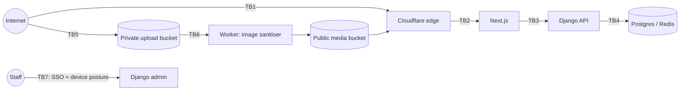

# 05 · Security Architecture

> The platform is open to the public, so **every request is presumed hostile** until
> proven otherwise. The goals, in priority order:
> 1. **Nobody can impersonate a founder.**
> 2. **Nobody can alter what a founder published without it being visible and provable.**
> 3. **Nobody can take over accounts or staff powers.**
> 4. **Bulk harvesting of content and personal data is expensive, detectable and legally prohibited.**
> 5. **An attacker who gets one layer still hits another** (defence in depth).

Baseline standard: **OWASP ASVS 4.0 Level 2**, plus the OWASP API Security Top 10.

---

## 1. Trust boundaries

| Boundary | What crosses it | Primary controls |
|---|---|---|
| TB1 | All public traffic | TLS 1.2+/HSTS preload, WAF managed rules, bot score, edge rate limits, Turnstile |
| TB2 | Requests to the web tier | Origin accepts only Cloudflare IPs (authenticated origin pulls / tunnel) |
| TB3 | API calls | Session + CSRF, DRF permissions, throttles, serializers with strict max lengths |
| TB4 | Data access | Private subnet, TLS, least-privilege DB roles, append-only triggers |
| TB5 | Raw user files | Presigned POST pinned to one key, type and size, 5-minute expiry, private bucket |
| TB6 | Untrusted image bytes | Worker-only, full decode and re-encode, pixel cap, no metadata carried over |
| TB7 | Staff actions | Cloudflare Access (SSO + MFA + device posture) **and** in-app TOTP-verified session |

---

## 2. Threat model (STRIDE)

| # | Threat | Example attack | Mitigations (implemented ✅ / planned ⏳) |
|---|---|---|---|
| **S**1 | Founder impersonation | Sign up as "Elon" and publish a fake story | Publishing requires a `FounderProfile` created only by human approval ✅; work-email proof on the company domain ✅; free-mail and disposable domains blocked ✅; the email domain must match the company domain ✅; evidence URLs restricted to linkedin.com / crunchbase.com over https ✅; moderators cannot approve themselves ✅; yearly re-verification ✅ |
| S2 | Account takeover | Credential stuffing, phishing | Argon2id ✅; 12+ character passwords, common- and breached-password checks (HIBP k-anonymity) ✅; exponential lockout ✅; generic login errors ✅; TOTP required for founders and staff ✅ with replay protection ✅; edge rate limits ⏳ (Cloudflare config); WebAuthn passkeys ⏳ |
| S3 | Session hijack / fixation | Stolen cookie via XSS; fixation | HttpOnly, Secure, SameSite=Lax, `__Host-` prefix ✅; session rotated on login ✅; Redis-backed sessions revocable server-side ✅; strict CSP makes XSS exfiltration hard ✅ |
| S4 | Staff impersonation | Use a moderator's password to reach /admin | Admin requires `is_staff` + TOTP enabled + a session flagged `otp_verified` at API login ✅; admin reachable only through Cloudflare Access SSO ⏳ (infra); non-default admin path ✅ |
| **T**1 | Silent content edits | Author (or attacker) rewrites history after the story goes viral | Every save creates an immutable `StoryRevision` in a per-story hash chain ✅; `content_hash` shown publicly ✅; public revision list ✅; DB trigger blocks UPDATE/DELETE on revisions ✅ |
| T2 | Staff or insider tampering | Moderator edits a founder's words; DBA edits rows | Admin makes story content read-only ✅; moderation can only change status, with a reason ✅; hash-chained audit log ✅; triggers + role grants (INSERT/SELECT only) ✅; nightly chain verification with alerting ✅; daily head hash exported to an object-lock bucket ✅ |
| T3 | Stored XSS in stories | `<script>` or `javascript:` links in Markdown | Markdown parser with raw HTML **disabled** ✅ → nh3 allowlist sanitiser (tags, attrs, URL schemes) ✅ → nonce-based CSP with `strict-dynamic`, no inline scripts ✅; images in the body are disabled ✅; comments are plain text escaped by React ✅ |
| T4 | CSRF | Cross-site form posts a like/story | Django CSRF on all unsafe methods with SessionAuthentication ✅; SameSite=Lax ✅; same-origin API (no CORS) ✅ |
| T5 | Malicious uploads | Polyglot JPEG/JS, decompression bomb, EXIF GPS leak | Magic-byte sniffing ✅; `Image.verify()` ✅; pixel cap ✅; full re-encode to WebP ✅; metadata dropped ✅; originals never public ✅; separate buckets ✅; `nosniff` ✅ |
| T6 | Mass assignment / IDOR | PATCH `author_id`, read another user's draft or board | Explicit serializer field lists ✅; object-level permission checks ✅; querysets scoped to the owner ✅; UUIDs ✅; drafts return 404, not 403 ✅ |
| T7 | SQL injection | | Django ORM parameterisation only; no raw SQL on user input ✅ |
| **R**1 | "I never did that" | A moderator denies hiding a story | Audit entry for every privileged or security action, with actor, IP and UA ✅; `ModerationAction` requires a reason ✅ |
| **I**1 | Data harvesting | Scrape all stories, founder emails, subscriber list | See §5 Anti-scraping ✅/⏳; emails never exposed in public payloads ✅; no counts, no page-size control ✅ |
| I2 | Account/email enumeration | Probe signup, login, subscribe | Generic login errors + constant-time hashing for unknown users ✅; subscribe always 202 ✅; signup returns 202 for existing emails ✅ (handle availability still leaks by design; see §9) |
| I3 | Secret leakage | Keys in git, logs or error pages | Env / secrets manager ✅; gitleaks in CI ✅; `DEBUG=False` + generic 500s ✅; structured logs without bodies ✅ |
| I4 | Evidence exposure | Leaked verification notes | Field-level encryption ✅; purged on decision ✅; readonly role denied on those tables ✅ |
| I5 | Token leakage via URL | Tokens in Referer or history | `Referrer-Policy: strict-origin-when-cross-origin` ✅; confirm pages strip the token from the URL with `history.replaceState` ✅; tokens single-use ✅ |
| **D**1 | Volumetric DoS | Flood the feed | Cloudflare DDoS + CDN caching of anonymous reads ✅/⏳; DRF throttles ✅; request size caps (512 KB body, 60k-char story) ✅ |
| D2 | Expensive-operation abuse | Upload floods, email bombing | Upload throttle ✅; resend cooldowns ✅; Turnstile on write endpoints ✅; async workers with acks_late ✅ |
| **E**1 | Privilege escalation | Reader → founder → moderator | Roles set only by admins ✅; founder status only through the reviewed workflow ✅; `role` read-only in the API ✅ |
| E2 | Container escape / lateral movement | RCE in an image library | Non-root, read-only containers, `no-new-privileges` ✅; the worker has no inbound network ✅; separate credentials per environment ✅ |
| E3 | Supply-chain compromise | Malicious dependency | Lockfiles (`npm ci`) ✅; Dependabot ✅; pip-audit + npm audit in CI ✅; pinned hashes via `pip-compile --generate-hashes` ⏳; image signing (cosign) ⏳ |

---

## 3. Authentication & sessions

| Control | Setting | Where |
|---|---|---|
| Password hashing | Argon2id (Django default params) | `PASSWORD_HASHERS` |
| Password policy | ≥ 12 chars, not similar to email/handle, not common, not numeric-only, not breached | `AUTH_PASSWORD_VALIDATORS`, `accounts/validators.py` |
| Lockout | 5 failures, then 1, 2, 4 … 60 minutes | `User.register_failed_login` |
| 2FA | TOTP (RFC 6238), ±1 step, replay-protected, secret encrypted | `accounts/totp.py` |
| Session store | Redis (server-side, revocable), 14 days | `SESSION_ENGINE` |
| Cookie flags | HttpOnly, Secure, SameSite=Lax, `__Host-` prefix in production | `settings/prod.py` |
| CSRF | Double-submit cookie + header, trusted origins list | Django CSRF |
| Why not JWT | See [ADR-0002](adr/0002-session-cookies-not-jwt.md) | |

Planned: WebAuthn passkeys (phishing-resistant) for founders and staff; "log out
everywhere"; new-device login emails.

## 4. Content integrity (anti-manipulation)

The strongest guarantee in the product. Full detail in [07](07-content-integrity-and-moderation.md).

1. **Per-story hash chain.** Each revision stores `content_hash` and
   `chain_hash = sha256(prev_chain + content_hash)`. `verify_story_integrity()` detects
   any change to the live row or to history.
2. **Public proof.** Every story shows its SHA-256 and links to its revision list. Anyone
   can recompute the hash from the text.
3. **Global audit chain.** Every security-relevant event is appended to a single hash
   chain, serialised by a Postgres advisory lock.
4. **Database-enforced append-only.** Triggers reject UPDATE and DELETE; in production the
   app role has only `INSERT, SELECT` on those tables ([roles.sql](../infra/postgres/roles.sql)).
5. **External anchoring (✅).** The nightly job exports the audit head hash to an
   object-lock (WORM) bucket (`AUDIT_ANCHOR_BUCKET`; move it to a separate cloud account for the strongest guarantee). Even a full database-superuser
   compromise then can't rewrite history without the mismatch showing.

## 5. Anti-scraping & anti-download

**What is honestly achievable:** anything a browser can display can be copied by a
determined human. The goal is to make **bulk** harvesting slow, expensive, detectable and
legally actionable, and to make sure the **valuable, private** data (emails, evidence,
original images, subscriber lists) is never reachable at all.

| Layer | Control | Status |
|---|---|---|
| Edge | Cloudflare Bot Management / Super Bot Fight Mode; block known scraper ASNs; JS challenge on anomalous rates | ⏳ config |
| Edge | L7 rate limit per IP on `/api/v1/stories*` | ⏳ config |
| App | Per-IP and per-user throttles (§04 table) keyed on the **trusted** client IP | ✅ |
| App | Cursor pagination only; no counts; no page-size parameter; max 24 per page | ✅ |
| App | No bulk, export or search-everything endpoint; no public API keys | ✅ |
| App | Sequential IDs never exposed (UUIDs, random slug suffixes) | ✅ |
| Data | Emails, verification data and subscriber lists never appear in public responses | ✅ |
| Media | Only display-resolution (≤ 1200 px), watermarked, metadata-free variants are public; originals stay private | ✅ |
| Media | Signed, expiring CDN URLs for media (Cloudflare token auth) | ⏳ |
| Detection | Alert on per-IP request-rate anomalies, many 404 slugs, high cursor depth | ⏳ ([11](11-observability-and-operations.md)) |
| Legal | `robots.txt` disallows `/api/` and known AI/data scrapers ✅; ToS forbidding automated collection and a DMCA process ⏳ | 🟡 |
| Crawlers | Allow reputable search engines on HTML (SEO), rate-limited | ✅ via SSR pages |

## 6. Browser security headers

| Header | Value |
|---|---|
| Content-Security-Policy (HTML) | `default-src 'self'; script-src 'self' 'nonce-…' 'strict-dynamic' https://challenges.cloudflare.com; object-src 'none'; base-uri 'none'; frame-ancestors 'none'; form-action 'self'; upgrade-insecure-requests` |
| Content-Security-Policy (API) | `default-src 'none'; frame-ancestors 'none'` |
| Strict-Transport-Security | `max-age=63072000; includeSubDomains; preload` |
| X-Frame-Options | `DENY` |
| X-Content-Type-Options | `nosniff` |
| Referrer-Policy | `strict-origin-when-cross-origin` |
| Permissions-Policy | camera, microphone, geolocation and payment disabled |
| Cross-Origin-Opener-Policy | `same-origin` |
| Cross-Origin-Resource-Policy | `same-site` (API) |

## 7. Secrets & keys

| Secret | Storage | Rotation |
|---|---|---|
| `DJANGO_SECRET_KEY` | Secrets manager → env | Yearly; rotating it invalidates sessions and signed digest links (use `SECRET_KEY_FALLBACKS`) |
| `FIELD_ENCRYPTION_KEYS` | Secrets manager | Yearly; prepend a new key, re-encrypt in the background, then drop the old one (MultiFernet) |
| DB / Redis credentials | Secrets manager, IAM auth where possible | 90 days |
| S3 keys | Scoped per bucket; workers get read on private and write on public | 90 days |
| Turnstile, email provider | Secrets manager | On staff change |

Never in git (enforced by gitleaks). Never in logs. Never in the frontend bundle (only
`NEXT_PUBLIC_*` values, which are non-secret, reach the browser).

## 8. Secure SDLC
- CI gates: ruff (with bandit `S` rules), pytest on Postgres, `manage.py check --deploy`,
  pip-audit, `npm audit`, ESLint, `tsc`, gitleaks. ✅
- Branch protection with required reviews; CODEOWNERS for `apps/common`, `apps/audit`,
  settings, and infra. ⏳
- Security tests are part of the suite: XSS sanitisation, CSRF enforcement, lockout,
  TOTP replay, IDOR on drafts and boards, audit tamper detection, EXIF stripping,
  decompression bombs, throttling that XFF can't bypass. ✅
- Pre-launch: an external penetration test, then yearly; a bug bounty (private, then
  public). ⏳
- `SECURITY.md` with a disclosure policy. ✅ ([SECURITY.md](../SECURITY.md))

## 9. Known residual risks (accepted or tracked)
| Risk | Why it remains | Tracking |
|---|---|---|
| Handle availability leaks whether a handle exists | Handles are public profile URLs anyway | Accepted |
| Signup timing differs for existing vs new email | New accounts get logged in; existing ones get a 202 | Move to email-first signup (magic link) in v1 |
| A founder may lie convincingly with a real company mailbox | Email + public evidence isn't proof of founding | Human review; community reports; revocation; add Companies House / SEC / registry lookups ⏳ |
| Determined manual copying | Inherent to public content | Watermarks, ToS, DMCA takedowns |
| Turnstile outage blocks signups | We fail closed deliberately | Status-page runbook |
| The timed sign-up prompt can be bypassed (no JS, reading the HTML) | It is a conversion nudge, not an access control; content is public by design | Accepted; see [13](13-accounts-and-authentication.md). Members-only content would need API-side enforcement |
