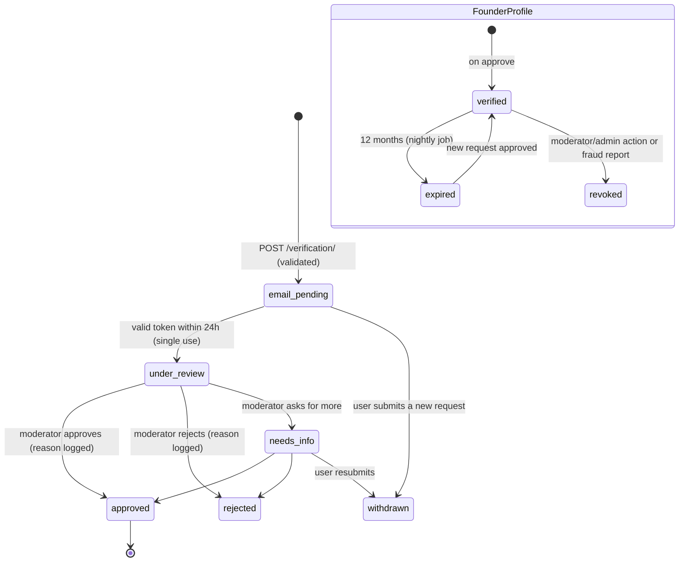

# 06 · Founder Verification

Founder status is the platform's core trust signal. It is **earned through two independent
proofs and a human decision**. It is **never** self-declared and never automated.

| Proof | What it shows | What it doesn't show |
|---|---|---|
| **Control of a mailbox on the company's domain** | The person works at, or controls, the company | That they *founded* it |
| **Public evidence reviewed by a person** (LinkedIn / Crunchbase) | A public, consistent history of a founder role | Nothing, if faked; that's why a human looks at it together with the email proof |

## State machine

## Step 1: Submit (`POST /api/v1/verification/`)

Server-side validation, in order ([serializers.py](../backend/apps/verification/serializers.py)):

1. `company_domain` is normalised (scheme, `www.` and path stripped; lower-cased) and must look like a domain.
2. The `work_email` domain must **not** be a free or disposable provider. Subdomains of
   blocked providers are blocked too ([list](../backend/apps/verification/data/free_email_domains.txt)).
   In production the list is extended from the maintained open-source disposable-domains list.
3. The `work_email` domain must **equal the company domain or be a subdomain of it**.
4. The domain must have an **MX record** (a DNS lookup with a 3 s timeout), so throwaway
   domains that can't receive mail are rejected.
5. At least one evidence URL, and each must be `https://` on an allow-listed host
   (`linkedin.com`, `crunchbase.com`). This blocks `javascript:` links, phishing lookalikes
   and SSRF bait. **The server never fetches these URLs**; only a human opens them.
6. Any open request from the same user is marked `withdrawn` (a partial unique index
   guarantees at most one open request).

`notes` (free text for the reviewer) are stored **encrypted** (Fernet) and **purged** when
the request is approved or rejected.

## Step 2: Prove the mailbox (`POST /verification/confirm-email`)

- The token is `secrets.token_urlsafe(32)` (256 bits). **Only its SHA-256 is stored.**
- It is valid for **24 hours**, **single use** (the hash is cleared on use), and **bound to
  the requesting user**: someone else's session can't redeem it, even with the link.
- The email is sent asynchronously through a retrying Celery task.
- The confirm page removes the token from the URL bar immediately after reading it.
- Throttled at 5 per hour per user or IP.

## Step 3: Human review

Moderators work the queue in the Django admin (bulk actions) or through
`/api/v1/moderation/verifications`. The **review checklist**:

1. Does the LinkedIn/Crunchbase profile name the same person (name, photo consistency) and
   a **founder** role at this company?
2. Does the company domain match the company's real website (Crunchbase, LinkedIn company page)?
3. Is the company real? Look for a registry entry (Companies House, Delaware/SEC, local
   registry), product site, news. *Planned: automated registry lookups as* hints *only.*
4. Any red flags: brand-new domain (WHOIS age < 30 days), mismatched names, lookalike
   domains (`acme-inc.co` vs `acme.com`), prior rejections for the same person or domain.
5. Decide: **approve**, **reject**, or **needs_info**. A reason is always recorded.

Guards in code ([services.py](../backend/apps/verification/services.py)):
- A reviewer **can't decide their own request**.
- Decisions only apply to `under_review` / `needs_info` (row locked with `SELECT … FOR UPDATE`).
- Every decision writes an audit entry (`verification.approve`, etc.).

On approve, the service upserts the `Company` by domain and creates or refreshes the
`FounderProfile` (`verified`, `expires_at = now + 365 days`).

## After verification

- **2FA gate:** founders must enable TOTP before they can publish (`REQUIRE_2FA_FOR_FOUNDERS`).
- **Badge:** shown next to the founder's name on cards, stories, comments and their profile,
  together with the company and title. The public profile states "verified via acme.com"
  but **never** shows the work email.
- **Expiry:** a nightly job marks profiles past `expires_at` as `expired`. Founder rights
  stop immediately; published stories stay up but lose the badge until re-verified.
  *Planned:* reminder emails 30 and 7 days before expiry.
- **Revocation:** moderators and admins can revoke (admin action or future API). This
  removes founder rights and is audited. Triggers: fraud reports, company-domain
  takeover, the person leaving their company *and* misrepresenting it.
- **Multiple founders per company** are supported; each verifies independently.

## Abuse scenarios

| Scenario | Defence |
|---|---|
| Uses a gmail/outlook address | Rejected (free-mail list) |
| Registers `acme-founders.com` with MX to impersonate Acme | Email proof passes, but the reviewer checks the domain against Crunchbase/LinkedIn and WHOIS age → reject; lookalike-domain check in the checklist |
| An employee of a real company claims to be a founder | Email proof passes; LinkedIn evidence shows a non-founder role → reject |
| Someone intercepts the link | The token only works for the logged-in requester; single use; 24h |
| Floods the queue with requests | 5 per hour per user; one open request per user; Turnstile on signup |
| A moderator colludes and approves a fake | Audit trail per decision; periodic second-reviewer sampling of approvals ⏳; revocation |
| A verified founder later posts a false story | Reports (reason `false_claim`, `misinformation`), hide/remove, revocation |

## Data minimisation
We keep: company name and domain, role title, evidence URLs, the decision and its reason.
We delete: free-text notes (on decision). We never show: the work email.
