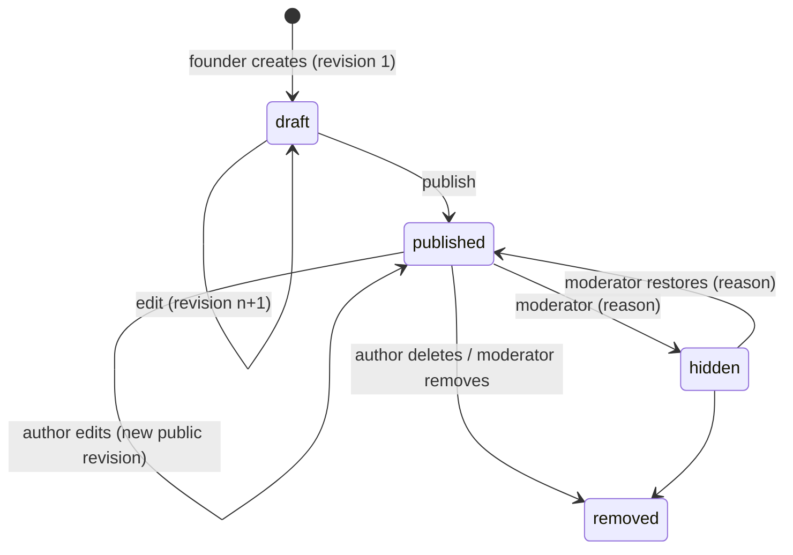

# 07 · Content Integrity & Moderation

## Part A: Integrity: "no one can falsely manipulate things"

### A.1 Story lifecycle

Hidden and removed stories can't be edited by the author (`locked`), so nobody can
quietly clean up evidence during an investigation.

### A.2 Revision hash chain
Every content change goes through `stories.services.save_revision()`:

```
content_hash(n) = SHA256( canonical_json({title, dek, body_markdown}) )
chain_hash(n)   = SHA256( chain_hash(n-1) + content_hash(n) )     # chain_hash(0) = ""
```

- `StoryRevision` rows are immutable: the model raises on save or delete, a Postgres
  trigger rejects UPDATE and DELETE, and the production role has no UPDATE or DELETE grant.
- `Story.content_hash` must equal the latest revision's `content_hash`, and it must equal a
  fresh hash of the live row. `verify_story_integrity(story)` checks all three and the
  whole chain. Tests prove that editing the live row out of band is detected.
- The public story page shows the **revision number and SHA-256**, and links to
  `/api/v1/stories/{slug}/revisions` (numbers, hashes, timestamps). Readers and journalists
  can prove what a story said, and whether it changed.
- *Planned:* a public "show diff between revisions" view, and a signed JSON export of a
  story's chain for citation.

### A.3 Audit log
Every security- or trust-relevant action appends to `audit_auditlog`:

| Category | Actions |
|---|---|
| Auth | `user.signup`, `auth.login`, `auth.login_failed`, `auth.otp_failed`, `auth.logout`, `auth.totp_enabled` |
| Verification | `verification.submitted`, `verification.email_confirmed`, `verification.approve/reject/needs_info`, `founder.revoked`, `founder.expired` |
| Content | `story.created`, `story.updated`, `story.published`, `story.removed_by_author` |
| Moderation | `moderation.<action>` (+ reason), `report.filed` |
| Digest | `digest.drafted`, `digest.approved`, `digest.sent` |

Hash chain: `hash = SHA256(prev_hash + canonical_json(row))`. Appends are serialised with
`pg_advisory_xact_lock`. `manage.py verify_audit_chain` and the nightly Celery job walk the
whole chain and page on-call at the first bad entry. The admin UI is **read-only** (no add,
change or delete permissions, even for superusers).

### A.4 What staff can and cannot do
| Action | Moderator | Admin |
|---|---|---|
| Change a story's words | ❌ never | ❌ never (admin fields are read-only) |
| Hide / restore / remove a story | ✅ with reason | ✅ with reason |
| Feature a story for the digest | ❌ | ✅ (via admin; a dedicated editor role is planned) |
| Delete audit entries or revisions | ❌ | ❌ (blocked in model, trigger and DB grants) |
| Approve their own verification | ❌ | ❌ |

## Part B: Moderation

### B.1 Inputs
1. **Reports** from logged-in users: reasons `spam`, `false_claim`, `plagiarism`,
   `harassment`, `misinformation`, `other`. One open report per user per target.
   Turnstile-protected and throttled.
2. **Held comments** from the rule engine (below).
3. **Verification queue** ([06](06-founder-verification.md)).

### B.2 Rule-based spam engine (no ML, see [ADR-0004](adr/0004-no-ai.md))
`apps/moderation/rules.py` returns explainable flags. Any flag holds the comment as
`pending`, so it's invisible until a moderator approves it.

| Flag | Rule |
|---|---|
| `too_many_links` | more than 2 URLs |
| `new_account_link` | any URL from an account younger than 24h |
| `repeated_characters` | 10+ repeats of one character |
| `blocked_term` | curated phrase list (crypto giveaways, "DM for promo"…) |
| `shouting` | > 70% uppercase letters over 20+ letters |

Rules are code-reviewed and versioned. The flags are stored on the comment, so every
moderation decision can be explained.

### B.3 Actions
`POST /api/v1/moderation/actions` (or the admin): `hide_story`, `restore_story`,
`remove_story`, `hide_comment`, `approve_comment`, `suspend_user`, `unsuspend_user`,
`dismiss_report`. A **reason is mandatory**. Each action is atomic with its report status
update, creates a `ModerationAction` row and an audit entry, and keeps comment counters
consistent.

Suspension hides all of the user's stories from the wall, blocks their writes and removes
founder rights, all without deleting anything.

### B.4 Service levels (targets)
| Queue | Target |
|---|---|
| Reports with `false_claim` or `harassment` | first response within 4 business hours |
| Other reports | 2 business days |
| Held comments | 1 business day |
| Verification | 2 business days |

### B.5 Appeals & transparency
- Authors are notified (⏳ email) when a story is hidden, with the reason category.
- Appeals go to a different moderator than the one who acted.
- A quarterly transparency report publishes counts of verifications (approved/rejected),
  reports by reason, and actions taken.

### B.6 Plagiarism
Founders must publish their own experience. Reports with reason `plagiarism` are checked
manually (search engines, the original source). Confirmed plagiarism → remove, plus a
strike. Two strikes → founder status revoked. *Planned:* exact-duplicate detection across
stories (shingle hashes). That is deterministic, not ML.
