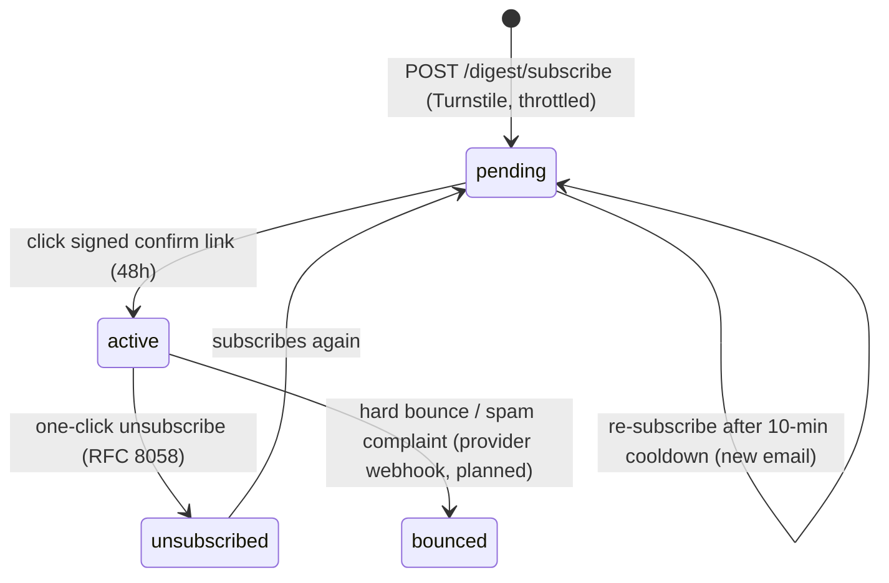
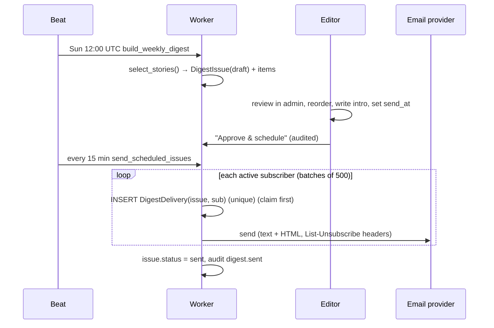

# 08 · The Weekly Email Digest

The "Reader's Digest" half of the product: the best founder stories of the week, delivered
by email, curated by an explainable algorithm plus human editors.

## Subscriber lifecycle



- **Double opt-in.** Nothing is sent until the address owner confirms.
- **No enumeration.** `subscribe` always returns the same `202` body.
- **No mail-bombing.** A 10-minute resend cooldown per address, a `subscribe` throttle of
  5 per hour per IP, and Turnstile.
- **Stateless tokens.** Confirm and unsubscribe links carry Django-signed tokens with
  separate salts; confirm expires after 48h. Nothing is stored, so there's nothing to leak.
- **Unsubscribe is POST-only.** The email footer links to `/digest/unsubscribe?token=…`, a
  page with a button. The `List-Unsubscribe` header points at the API for the mail
  provider's one-click POST. Link scanners that prefetch GETs can never unsubscribe anyone.

## Curation algorithm (deterministic)

Source: [`apps/digest/curation.py`](../backend/apps/digest/curation.py)

1. **Eligible:** published in the last 7 days, author currently a verified founder, not suspended.
2. **Editor picks first:** stories with `featured_at` in the window, oldest pick first.
3. **Then by score**, a Hacker-News-style gravity formula:
   ```
   score = (likes + 2·saves + 1.5·comments + 1) / (age_hours + 2) ^ 1.5
   ```
   Saves weigh most because a save is the strongest "I'll come back to this" signal.
   Engagement comes only from logged-in, rate-limited, Turnstile-gated accounts, which
   makes gaming it expensive.
4. **Diversity:** at most one story per founder and per company.
5. **Size:** 3–7 stories; below 3 eligible stories no issue is drafted that week.

## Pipeline



**Idempotency:** the `(issue, subscription)` unique constraint is claimed *before* each
send. A crashed or retried worker skips anyone already claimed, so nobody gets the issue twice.

**Trade-off:** a crash *between* claim and send means that subscriber misses one issue.
That is preferred over double-sending. A reconciliation job against the provider's message
log is planned.

## Email content & privacy
- Plain-text and HTML versions ([templates](../backend/templates/digest/)); inline CSS and
  table layout for client compatibility; dark-mode-friendly colours.
- **No tracking pixels, no click-tracking redirects.** Links go straight to the story URL.
  We measure success by on-site reads with the `?ref=digest` parameter (⏳), not by
  surveilling inboxes.
- The footer says why you're receiving it and has a one-click unsubscribe.

## Deliverability & authentication (production checklist)
| Item | Setting |
|---|---|
| Sending domain | `mail.walloffounders.com` (separate from transactional `notify.`) |
| SPF | `v=spf1 include:<provider> -all` |
| DKIM | 2048-bit, provider-managed, rotated yearly |
| DMARC | Start at `p=none; rua=…`, move to `p=quarantine` after 4 weeks clean, then `p=reject` |
| BIMI | After DMARC `p=reject`, add a verified logo |
| One-click unsubscribe | `List-Unsubscribe` + `List-Unsubscribe-Post: List-Unsubscribe=One-Click` ✅ |
| Bounce & complaint webhooks | Provider → `/api/v1/digest/webhooks/<provider>` with signature verification → status `bounced` (⏳) |
| Complaint rate | Keep < 0.1% (Gmail and Yahoo bulk-sender rules); alert at 0.08% |
| Warm-up | Ramp volume over 2–4 weeks on a new IP or domain |

## Web archive
Sent issues are public at `/digest` and `/digest/{number}`, which is good for SEO and for
sharing. Items whose stories were later hidden or removed drop out of the archive automatically.
