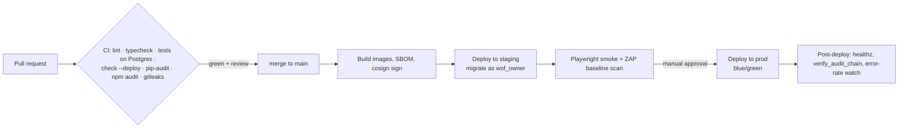

# 10 · Infrastructure & Deployment

## Environments
| Env | Purpose | Data | Access |
|---|---|---|---|
| local | Development (`docker compose`) | Seeded demo data | Developer |
| ci | Automated tests (GitHub Actions) | Ephemeral Postgres | CI only |
| staging | Pre-prod mirror, same IaC as prod | Synthetic data only; **never** a production copy | Team, via SSO |
| production | Live | Real | Deploy pipeline; break-glass access audited |

## Reference production architecture

Cloud-agnostic by design; shown on AWS with Cloudflare in front. It maps one-to-one to
GCP (Cloud Run / Cloud SQL / Memorystore) or Fly.io + managed Postgres for a lean start.

| Layer | Service | Notes |
|---|---|---|
| DNS, TLS, WAF, bot management, CDN, Turnstile, Access | Cloudflare | Origin reachable only via Cloudflare Tunnel or authenticated origin pulls |
| Web (Next.js) | ECS Fargate or Cloud Run, 2+ tasks | Non-root, read-only filesystem; `output: standalone` image |
| API (Django/gunicorn) | ECS Fargate, 2+ tasks, autoscale on CPU and latency | Private subnets; no public IP |
| Workers + beat | ECS Fargate (beat: exactly 1 task) | Separate queues: `media`, `email`, `default` |
| Database | RDS PostgreSQL 16 Multi-AZ + 1 read replica | Encrypted (KMS), TLS required, PITR 14 days, deletion protection |
| Redis | ElastiCache (TLS + AUTH) | Sessions, throttles, broker |
| Object storage | S3: `wof-uploads` (private, 7-day lifecycle), `wof-media` (CloudFront/Cloudflare origin only) | Block Public Access on both; OAC for CDN |
| Email | Postmark (transactional) + SES or Postmark broadcast (digest) | Separate subdomains and streams |
| Secrets | AWS Secrets Manager | Injected as env at task start |
| Admin | `admin.walloffounders.com` → Django `/<DJANGO_ADMIN_URL>` behind **Cloudflare Access** | SSO + MFA + device posture, plus the app-level TOTP-session check |
| Audit anchoring | S3 bucket with **Object Lock (compliance mode)** in a separate account | Nightly head-hash export |

### Network
```
Internet ──► Cloudflare ──(tunnel)──► public ALB (Cloudflare IPs only)
                                         ├─► web tasks  (private subnet)
                                         └─► api tasks  (private subnet)  ─► RDS / Redis (isolated subnets)
workers (private subnet, no ingress) ─► RDS / Redis / S3 (VPC endpoints) / email API (NAT, egress allow-list)
```
Security groups follow least privilege: the DB accepts only API and worker SGs; Redis the
same. Egress from workers is limited to the email provider, S3 endpoints, the HIBP range
API and Cloudflare Turnstile.

## Containers
- `backend/Dockerfile`: Python 3.12 slim, runs as UID 10001, source made read-only,
  collectstatic at build, a healthcheck on `/healthz`, gunicorn with `max-requests` recycling.
- `frontend/Dockerfile`: multi-stage Node 22 Alpine, `npm ci`, standalone output, runs as UID 10001.
- Runtime flags (compose and prod): `read_only: true`, `tmpfs: /tmp`, `no-new-privileges`, all capabilities dropped.

## Implemented infrastructure-as-code
The reference architecture is implemented in [`infra/terraform`](../infra/terraform/README.md),
with a GitHub Actions deploy pipeline in [`.github/workflows/deploy.yml`](../.github/workflows/deploy.yml).
The README has the first-time setup steps. Terraform formatting and a Checkov security scan
run in CI (388 checks pass; each accepted exception is annotated in place).

## CI/CD pipeline

- `.github/workflows/ci.yml` implements the CI box (✅); `.github/workflows/deploy.yml` builds,
  pushes, migrates, rolls out and smoke-tests (✅). A separate staging environment and the
  Playwright/ZAP stage are ⏳.
- **Migrations** run as a one-off task using the `wof_owner` role. Application tasks use
  `wof_app`, which can't run DDL ([roles.sql](../infra/postgres/roles.sql)).
- **Zero-downtime migrations:** expand → deploy → contract. Never rename or drop in the same
  release that stops using a column.

## Configuration
All configuration comes from environment variables ([.env.example](../.env.example)).
Production refuses to boot without `DJANGO_SECRET_KEY`, `FIELD_ENCRYPTION_KEYS` and
`TURNSTILE_SECRET_KEY` (`settings/prod.py`). `manage.py check --deploy` runs in CI against
the prod settings.

## Backups & disaster recovery
| Asset | Mechanism | RPO | RTO |
|---|---|---|---|
| Postgres | PITR (continuous WAL) + nightly snapshots copied cross-region, encrypted | ≤ 5 min | ≤ 1 h |
| Media bucket | Versioning + cross-region replication | ≤ 15 min | ≤ 1 h |
| Audit head hashes | Object-lock bucket, separate account | 24 h | n/a |
| Redis | Not backed up (sessions and throttles are disposable) | n/a | minutes |

Restore drills run **quarterly**. After any restore, run `manage.py verify_audit_chain` and
compare the head hash with the anchored value to prove the restored data wasn't tampered with.

## Cost tiers (rough, monthly)
| Stage | Setup | Est. cost |
|---|---|---|
| MVP (≤ 50k MAU) | Fly.io/Render: 2 small web, 2 small API, 1 worker; managed Postgres (small); Upstash Redis; R2; Cloudflare Pro; Postmark | ~$150–300 |
| Growth (≤ 1M MAU) | AWS reference above, modest instance sizes | ~$1.5–3k |
| Scale (10M MAU) | Autoscaling, larger RDS + replicas, search cluster | ~$8–15k |

## Local development
Two ways to run everything on a laptop:

| | `make dev` (no Docker) | `make up` (Docker) |
|---|---|---|
| Needs | Python 3.11+, Node 20+ | Docker |
| Database | SQLite (WAL) in `backend/.local/` | PostgreSQL 16 |
| Cache / sessions | in-memory / database | Redis |
| Background jobs | run inline in the request | Celery worker + beat |
| Email | files in `backend/.local/mail/` | Mailpit at http://localhost:8025 |
| Images | `backend/.local/media/`, served by Django (`wof.settings.local`) | MinIO (S3 API) |
| Scheduled jobs | `make dev-periodic` | beat |

Both run the same application code, security checks and tests. The no-Docker mode swaps only
the infrastructure (`backend/wof/settings/local.py`, `backend/apps/stories/storage.py`).

```bash
make dev                           # http://localhost:3000, API on :8000, admin at :8000/admin/
make up && make seed               # the Docker stack, then demo data
```
