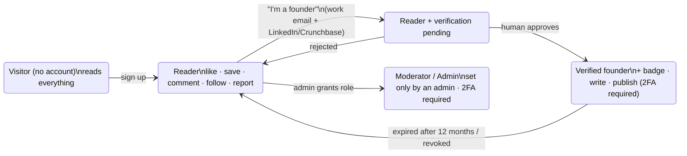

# 13 · Accounts & Authentication

A plain-language guide to who can do what, how people sign in, and how accounts are
protected on a site that anyone can read.

## One account, earned upgrades

There is **one kind of account and one login** for everyone. Being a founder is not a
different login. It is a status an account **earns** by passing verification.

| Who | Can read | Like, save, comment, follow, report | Publish stories | Moderate |
|---|---|---|---|---|
| Visitor | ✅ | ❌ | ❌ | ❌ |
| Reader | ✅ | ✅ | ❌ | ❌ |
| Verified founder | ✅ | ✅ | ✅ (with 2FA on) | ❌ |
| Moderator / Admin | ✅ | ✅ | only if also a verified founder | ✅ (with 2FA on) |

### Why not a separate "log in as founder"?
- **Founder status must be proven, never chosen.** A second login door would invite people
  to pick it. Here, the server grants founder rights only when a moderator approves a
  verification request ([06](06-founder-verification.md)).
- **One set of credentials to protect**, one login form, one session model.
- **Founders are readers too.** They save and comment like everyone else, with the badge on top.

### "Two paths, one account" at sign-up
The sign-up prompt and page offer **Join as a reader** or **I'm a founder**. Both create
exactly the same account. The founder path shows the four steps ahead (account → work
email → evidence review → 2FA) and then drops the new user straight into `/verify`.
Choosing it grants nothing by itself.

## Passwords, export and deletion
- **Forgot password:** `/forgot` emails a link that works once and expires in 1 hour. The
  response is identical whether or not the email has an account, and each account gets at most
  one email per 10 minutes. Setting the new password signs out every device and emails a notice.
  It does not log you in, so 2FA still applies at the next login.
- **Change password:** Settings › Security. Requires the current password; keeps this session
  and signs out every other one.
- **Download your data:** Settings › Your data gives one JSON file with everything tied to the account.
- **Delete your account:** requires the password, the 2FA code if enabled, and typing DELETE.
  Stories come off the Wall; comments are blanked; likes, boards, follows, subscriptions,
  verification data and uploads are erased; the account is anonymised and signed out
  everywhere. The handle is retired (only its hash is kept) so nobody can re-register it to
  impersonate a deleted founder. Past revisions of removed stories stay in the tamper-evident
  record, linked only to an anonymous ID.

## Signing up and logging in

| Step | What happens | Protection |
|---|---|---|
| Sign up | Email, handle, password | Bot check (Turnstile); ≥ 12-character password, rejected if common or found in a data breach (checked without revealing it); rate limit 5/hour |
| Log in | Email + password | The same error for "no such user" and "wrong password"; lockout after 5 failures, getting longer each time (1 → 60 minutes); rate limit 10/min |
| 2FA (founders & staff must; readers may) | 6-digit code from an authenticator app | Each code works once; the secret is stored encrypted |
| Session | A cookie is set | `HttpOnly` (JavaScript can't read it), `Secure`, `SameSite=Lax`, `__Host-` prefix; stored server-side, so it can be revoked instantly |
| Every change (POST/PATCH/DELETE) | Must carry a CSRF token | Blocks other websites from acting as you |
| Suspension | A moderator suspends an account | Every existing session ends on its next request; the stories disappear from the wall |
| Staff admin console | Separate hostname behind SSO | Requires a staff account, 2FA on, **and** a login that passed 2FA |

Details and the threat model are in [05-security-architecture.md](05-security-architecture.md).
Why cookies rather than tokens: [ADR-0002](adr/0002-session-cookies-not-jwt.md).

## The timed sign-up prompt (what visitors see)

Everything is visible on landing. After a while, logged-out visitors are invited to join:

1. **Soft prompt** after **45 seconds** on the site (the clock keeps running across pages
   within the visit). It can be closed with ✕, Escape or a click outside.
2. **Firm prompt** 90 seconds after closing the soft one. There's no close button, the
   page behind is blurred and can't be scrolled or clicked, and the only ways forward are
   **Join as a reader**, **I'm a founder** or **Log in**.

Both prompts include the **log-in form inline** (email, password with a show/hide toggle, and
the 2FA code step when needed), so members can sign in without leaving the page they're on.
The same `LoginForm` component powers `/login`.
3. **Never shown** on the log-in, sign-up, verification, settings or email-link pages (so
   nobody gets trapped), to logged-in users, or to search-engine crawlers and link-preview bots.

The delay is configurable with `NEXT_PUBLIC_AUTH_PROMPT_DELAY_MS` (set at build time).
Logic: [`frontend/lib/auth-prompt.ts`](../frontend/lib/auth-prompt.ts); UI:
[`frontend/components/AuthPrompt.tsx`](../frontend/components/AuthPrompt.tsx).

> **Important: the prompt is a sign-up nudge, not a security control.** Every story is in
> the server-rendered HTML (so search engines can index it), and the API serves published
> stories without login. Someone who disables JavaScript or reads the HTML directly won't
> see the prompt, and that's fine. What actually protects the platform is server-side:
> rate limits, no bulk or export endpoints, cursor-only pagination, bot management at the
> edge, and never exposing private data (emails, drafts, verification evidence) to
> anyone who isn't entitled to it. If stories ever need to be truly members-only, that
> has to be enforced in the API (return a teaser to anonymous users), not in the browser.

## What is never public, logged in or not
- Anyone's email address or work email.
- Drafts, hidden or removed stories (they return "not found", indistinguishable from missing).
- Private boards (the default).
- Verification evidence and moderator notes.
- The subscriber list.
- Original full-resolution images and their metadata.
